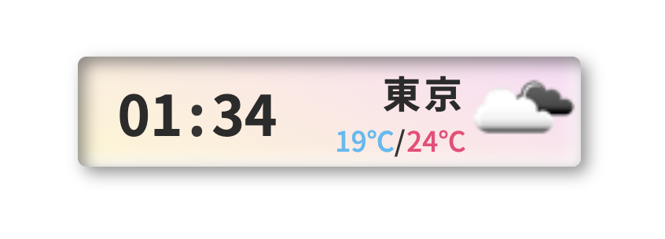

# OBS 向け 時計&天気予報表示

朝のニュースや夜の情報番組の左上によくあるアレ

ダウンロードしてお使いください

## 使い方

### 1. OBS への読み込み

-   OBS のソース追加からブラウザを選択
-   ローカルファイルのチェックボックスに ✅
-   ダウンロードした`index.html`を読み込んでください

### 2. API キーの取得

天気予報の取得に[openweathermap](https://openweathermap.org/)を使用しています

-   [こちら](https://auto-worker.com/blog/?p=1612)を参考にアカウント作成(無料)と API キーを取得してください
-   取得した API キーを`GetWeather.js`の上部に書き込んでください

### オプション 天気予報の地域の編集

-   以下の方法で表示したい地域の緯度・経度を取得（[こちら](https://support.google.com/maps/answer/18539?hl=ja&co=GENIE.Platform%3DDesktop)より引用）
    -   パソコンで Google マップを開きます。
    -   地図上の目的の場所を右クリックします。
    -   ポップアップウィンドウが開きます。
        -   緯度と経度が、画面上部に 10 進数形式で表示されます。
    -   座標を自動的にコピーするには、緯度と経度を左クリックします。
-   取得した緯度・経度を`GetWeather.js`へ追加してください
